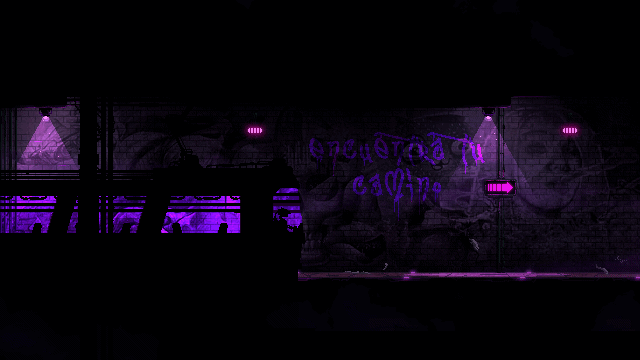

<!-- Centered Banner GIF -->

  

<!-- Centered Title -->
<h1 align="center">Hi 👋, I'm Dipanshu Kumar</h1>

<!-- Two-column layout: Left Text, Right GIF -->
<table align="center">
  <tr>
    <!-- Left Column -->
    <td width="60%" align="left" style="vertical-align: top;">
      <h3>
        I'm a passionate and results-driven software developer with a knack for problem-solving and a love for clean, efficient code.   
        My journey in the tech world has been fueled by a relentless curiosity, driving me to explore the depths of programming and build innovative solutions.
      </h3>
    </td>

    <!-- Right Column -->
    <td width="40%" align="center">
      
    </td>
  </tr>
</table>

<!-- Profile Views -->

  

---

### 📫 How to reach me

**Email**: dipanshuhub0411@gmail.com

---

### 🤝 Connect with me

  
  

---

### 🛠️ Languages and Tools

<!-- your icons here (kept unchanged for brevity) -->

---

### 📈 GitHub Stats

  

